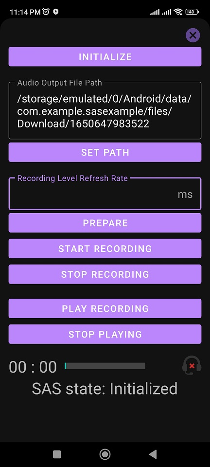

Android Speech Assessment Library Sample App
=================

A sample app illustrating use of SAS Library.

SAS Library is currently under heavy development.
Note that some changes (such as database schema modifications) are not backwards
compatible and may cause the app to crash. In this
case, please uninstall and re-install the app.

Introduction
------------

Android Jetpack is a set of components, tools and guidance to make great Android apps. They bring
together the existing Support Library and Architecture Components and arrange them into four
categories:

Getting Started
---------------
This project uses the Gradle build system. To build this project, use the
`gradlew build` command or use "Import Project" in Android Studio.

There are two Gradle tasks for testing the project:
* `connectedAndroidTest` - for running Espresso on a connected device
* `test` - for running unit tests

For more resources on learning Android development, visit the
[Developer Guides](https://developer.android.com/guide/) at
[developer.android.com](https://developer.android.com).

### API key

The app is still usable without an API key.

Screenshots
-----------

Libraries Used
--------------
* [Foundation][0] - Components for core system capabilities, Kotlin extensions and support for
  multidex and automated testing.
  * [AppCompat][1] - Degrade gracefully on older versions of Android.
  * [Android KTX][2] - Write more concise, idiomatic Kotlin code.
  * [Test][3] - An Android testing framework for unit and runtime UI tests.
* [Architecture][4] - A collection of libraries that help you design robust, testable, and
  maintainable apps. Start with classes for managing your UI component lifecycle and handling data
  persistence.
  * [Data Binding][5] - Declaratively bind observable data to UI elements.
  * [Lifecycles][6] - Create a UI that automatically responds to lifecycle events.
  * [Navigation][7] - Handle everything needed for in-app navigation.
  * [Room][8] - Access your app's SQLite database with in-app objects and compile-time checks.
  * [Kotlin Coroutines][9] for managing background threads with simplified code and reducing needs for callbacks
  * [EasyPermission][10] for managing permission related checks

[0]: https://developer.android.com/jetpack/components
[1]: https://developer.android.com/topic/libraries/support-library/packages#v7-appcompat
[2]: https://developer.android.com/kotlin/ktx
[3]: https://developer.android.com/training/testing/
[4]: https://developer.android.com/jetpack/arch/
[5]: https://developer.android.com/topic/libraries/data-binding/
[6]: https://developer.android.com/topic/libraries/architecture/lifecycle
[7]: https://developer.android.com/topic/libraries/architecture/navigation/
[8]: https://developer.android.com/topic/libraries/architecture/room
[9]: https://kotlinlang.org/docs/reference/coroutines-overview.html
[10]: https://github.com/vmadalin/easypermissions-ktx

Upcoming features
-----------------
Updates will include incorporating additional Jetpack components and updating existing components
as the component libraries evolve.

Interested in seeing a particular feature of the Android Framework or Jetpack implemented in this
app? Please open a new [issue]().

Android Studio IDE setup
------------------------
For development, the latest version of Android Studio is required. The latest version can be
downloaded from [here](https://developer.android.com/studio/).

SAS Library uses [ktlint](https://ktlint.github.io/) to enforce Kotlin coding styles.
Here's how to configure it for use with Android Studio (instructions adapted
from the ktlint [README](https://github.com/shyiko/ktlint/blob/master/README.md)):

- Close Android Studio if it's open

- Download ktlint using these [installation instructions](https://github.com/pinterest/ktlint/blob/master/README.md#installation)

- Apply ktlint settings to Android Studio using these [instructions](https://github.com/pinterest/ktlint/blob/master/README.md#-with-intellij-idea)

- Start Android Studio

Copyright 2022 DAPLAB, IIT Bombay.

Licensed to the Apache Software Foundation (ASF) under one or more contributor
license agreements.  See the NOTICE file distributed with this work for
additional information regarding copyright ownership.  The ASF licenses this
file to you under the Apache License, Version 2.0 (the "License"); you may not
use this file except in compliance with the License.  You may obtain a copy of
the License at

  https://www.apache.org/licenses/LICENSE-2.0

Unless required by applicable law or agreed to in writing, software
distributed under the License is distributed on an "AS IS" BASIS, WITHOUT
WARRANTIES OR CONDITIONS OF ANY KIND, either express or implied.  See the
License for the specific language governing permissions and limitations under
the License.
